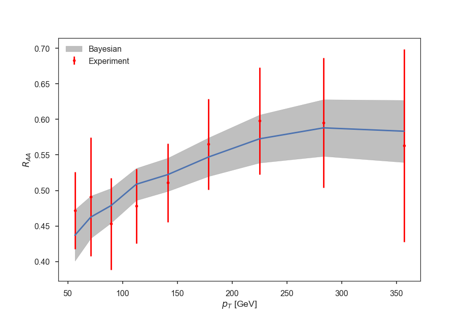
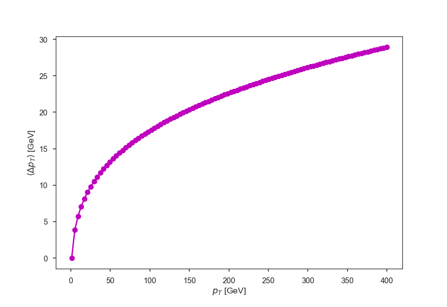

# Data driven extraction of jet energy loss distributions in heavy ion collisions
Code Authors: Long-Gang Pang, Ya-Yun He and Xin-Nian Wang

## Introduction

This python package is a simple tool to extract the pt loss distribution
and the mean pt loss as a function of jet pt,
from the experimental single jet RAA for AA collisions at a specific beam energy 
(with pt spectra in proton+proton collisions at the same beam energy) or the single hadron/gamma hadron
pt spectra (without pt spectra in proton+proton collisions).

Example:
```python
from jeteloss import PythiaPP, RAA2Eloss
pp_x, pp_y = PythiaPP(sqrts_in_gev = 2760)
raa_fname = "RAA_2760.txt"
eloss = RAA2Eloss(raa_fname, pp_x, pp_y)
eloss.train()
eloss.save_results()
eloss.plot_mean_ptloss()
eloss.plot_pt_loss_dist()
```
The format of input data "RAA_2760.txt":
The first row is the comment row start with "#" and data description for the following columns,
"RAA_x, RAA_xerr, RAA_y, RAA_yerr" where RAA_x is the pt bins, RAA_xerr is the uncertainties of these pt bins, RAA_y is the RAA value in one A+A collisions, RAA_yerr is the uncertainties of RAA_y.

## Results
  

## Citation

If you have used this package to produce results for presentation/publications,
please cite the following two papers, from where one can find the detailed information of 
the underlying physics.

@article{He:2018gks,
      author         = "He, Yayun and Pang, Long-Gang and Wang, Xin-Nian",
      title          = "{Bayesian extraction of jet energy loss distributions in
                        heavy-ion collisions}",
      year           = "2018",
      eprint         = "1808.05310",
      archivePrefix  = "arXiv",
      primaryClass   = "hep-ph",
      SLACcitation   = "%%CITATION = ARXIV:1808.05310;%%"
}

@article{He:2018xjv,
      author         = "He, Yayun and Cao, Shanshan and Chen, Wei and Luo, Tan
                        and Pang, Long-Gang and Wang, Xin-Nian",
      title          = "{Conspiracy behind single inclusive jet suppression in
                        heavy-ion collisions}",
      year           = "2018",
      eprint         = "1809.02525",
      archivePrefix  = "arXiv",
      primaryClass   = "nucl-th",
      SLACcitation   = "%%CITATION = ARXIV:1809.02525;%%"
}

## Installation

### Method 1: using pip
Step 1: 
> pip install jeteloss

Step 2:
> git clone git@github.com:lgpang/jeteloss.git

Step 3:
> cd jeteloss/examples

> python example1.py

### Method 2: install from local directory
Step 1: download the code from github
> git clone git@github.com:lgpang/jeteloss.git

Step 2: install jeteloss and dependences
> cd jeteloss

> python setup.py install

Step 3: run example code
> cd examples

> python example1.py

### Method 3: using anaconda

Step 1: To create one clean python virtual environment 
> conda create -n test_jeteloss python=3.6

Step 2: To activate this environment, use:
> source activate test_jeteloss

Step 3: Install jeteloss module and its dependences
> pip install jeteloss

Step 4: Run the example code downloaded using:
> git clone git@github.com:lgpang/jeteloss.git

> cd jeteloss/examples

> python example1.py

Step 5: To deactivate an active environment, use:
> source deactivate

Step 6: Clean up
To see how many environments do you have, use:
> conda env list

To remove one environment, use:
> conda remove --name test_jeteloss --all

